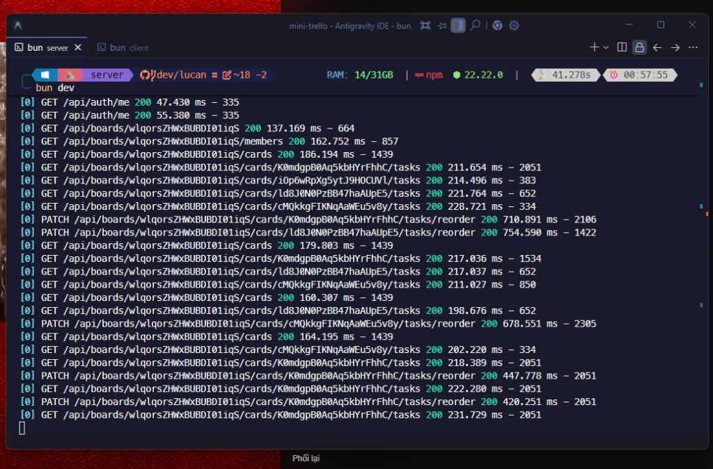

# 🗺️ Google Maps Clone - Location Search

Ứng dụng tìm kiếm và điều hướng địa điểm trực quan, hiện đại được xây dựng bằng **Next.js (App Router)**, **React 19**, **Leaflet** và **TailwindCSS v4**. Dự án hỗ trợ giao diện responsive tối ưu cho cả máy tính (Desktop) và thiết bị di động (Mobile).

---

## 📸 Giao diện ứng dụng (Screenshot)



---

## ✨ Tính năng nổi bật (Features)

- 🔍 **Tìm kiếm địa điểm thông minh:** Tích hợp OpenStreetMap Nominatim API cho phép tìm kiếm mọi địa danh, đường phố, thành phố trên toàn thế giới theo thời gian thực.
- 🗺️ **Bản đồ tương tác toàn diện:** Hiển thị bản đồ OpenStreetMap với đầy đủ thao tác zoom, kéo thả, gắn ghim (Marker) vị trí chính xác.
- 🚀 **Điều hướng mượt mà (Smooth FlyTo):** Khi chọn một địa điểm từ danh sách kết quả, bản đồ sẽ tự động kích hoạt hiệu ứng camera `flyTo` mượt mà đến tọa độ chỉ định.
- 📱 **Giao diện Responsive cho Mobile & Desktop:**
  - **Desktop:** Layout 2 cột chuyên nghiệp với Sidebar cố định kính mờ (Glassmorphism) bên trái và bản đồ toàn cảnh bên phải.
  - **Mobile:** Bản đồ hiển thị toàn màn hình (`100dvh`), thanh tìm kiếm dạng floating card ở phía trên, danh sách kết quả có thể thu gọn/mở rộng linh hoạt, và card thông tin địa điểm ghim cố định ở đáy màn hình.
- ⚡ **Trải nghiệm người dùng cao cấp (UX/UI):**
  - Tích hợp **Skeleton Loading** hiển thị trạng thái đang tải khi tìm kiếm.
  - Xử lý trạng thái **Empty State** khi không tìm thấy kết quả.
  - Nút bấm xóa nhanh từ khóa (`X`) và bàn phím điều hướng accessible (`Enter`, `Space`).
- 🛠️ **Kiến trúc code chuẩn mực & Hiệu năng cao:**
  - Tách nhỏ component theo nguyên tắc Single Responsibility (`SearchInput`, `PlaceCard`, `PlaceList`, `MapController`).
  - Áp dụng **Derived State** loại bỏ hoàn toàn lỗi cascading renders (`Calling setState synchronously within an effect`).
  - Xử lý triệt để lỗi SSR `window is not defined` của Leaflet bằng Dynamic Import (`ssr: false`).
  - Cấu hình tường minh Leaflet Marker icons tránh lỗi mất ảnh 404 thường gặp trong bundler.

---

## 🛠️ Công nghệ sử dụng (Tech Stack)

| Hạng mục | Công nghệ / Thư viện | Mô tả |
| :--- | :--- | :--- |
| **Framework** | [Next.js 16 (App Router)](https://nextjs.org/) | React Framework hiện đại với Turbopack bundler |
| **Core UI** | [React 19](https://react.dev/) & [TypeScript](https://www.typescriptlang.org/) | Xây dựng giao diện với kiểu dữ liệu tĩnh nghiêm ngặt |
| **Styling** | [TailwindCSS v4](https://tailwindcss.com/) | CSS Framework thế hệ mới với cấu hình nhanh và linh hoạt |
| **UI Components** | [shadcn/ui](https://ui.shadcn.com/) & [Radix UI](https://www.radix-ui.com/) | Thư viện UI components tinh chỉnh (Card, Button, Input, Badge, ScrollArea, Skeleton) |
| **Map & Geocoding** | [Leaflet](https://leafletjs.com/) & [React-Leaflet v5](https://react-leaflet.js.org/) | Hiển thị và điều khiển bản đồ tương tác |
| **Map Provider** | [OpenStreetMap](https://www.openstreetmap.org/) | Bản đồ mã nguồn mở miễn phí |
| **Geocoding API** | [Nominatim API](https://nominatim.org/) | API tìm kiếm tọa độ địa lý dựa trên tên địa điểm |
| **Icons** | [Lucide React](https://lucide.dev/) | Bộ icon hiện đại, tối giản và sắc nét |

---

## 📁 Cấu trúc thư mục (Project Structure)

```text
location-search/
├── app/
│   ├── globals.css              # Cấu hình Tailwind CSS & theme tokens
│   ├── layout.tsx               # Root Layout
│   └── page.tsx                 # Trang chính kết hợp Sidebar & Map Responsive
├── components/
│   ├── location-search/         # Các subcomponent tách nhỏ
│   │   ├── index.ts             # Barrel export
│   │   ├── place-card.tsx       # Card hiển thị từng địa điểm
│   │   ├── place-list.tsx       # Danh sách địa điểm & trạng thái loading/empty
│   │   └── search-input.tsx     # Form nhập từ khóa tìm kiếm
│   ├── ui/                      # Các component dùng chung từ shadcn/ui
│   │   ├── badge.tsx
│   │   ├── button.tsx
│   │   ├── card.tsx
│   │   ├── input.tsx
│   │   ├── scroll-area.tsx
│   │   └── skeleton.tsx
│   ├── location-search.tsx      # Container quản lý state & gọi API tìm kiếm
│   └── map.tsx                  # Component bản đồ Leaflet & MapController
├── lib/
│   ├── api/
│   │   └── search.ts            # Hàm gọi API Nominatim OpenStreetMap
│   ├── types/
│   │   ├── api/search.ts        # Type DTO response từ API
│   │   └── place.ts             # Interface dữ liệu địa điểm (Place)
│   └── utils.ts                 # Helper cn() merge Tailwind class
├── public/
│   └── screenshot.png           # Ảnh minh họa giao diện ứng dụng
├── package.json
└── tsconfig.json
```

---

## 🚀 Hướng dẫn cài đặt & Khởi chạy (Getting Started)

### 1. Yêu cầu môi trường
- [Node.js](https://nodejs.org/) version 18.18+ hoặc 20+ trở lên.
- Trình quản lý gói `npm`, `yarn` hoặc `pnpm`.

### 2. Cài đặt các gói phụ thuộc
Clone repository và cài đặt dependencies:
```bash
git clone https://github.com/PhatPham-Skipli/Google_Maps_Clone_NextJS_ModernReactUdemy.git
cd Google_Maps_Clone_NextJS_ModernReactUdemy
npm install
```

### 3. Khởi chạy môi trường phát triển (Development)
```bash
npm run dev
```
Truy cập [http://localhost:3000](http://localhost:3000) trên trình duyệt để trải nghiệm ứng dụng.

### 4. Build sản phẩm (Production)
```bash
npm run build
npm run start
```

---

## 📝 Giấy phép (License)
Dự án được phát triển phục vụ mục đích học tập và tham khảo.
